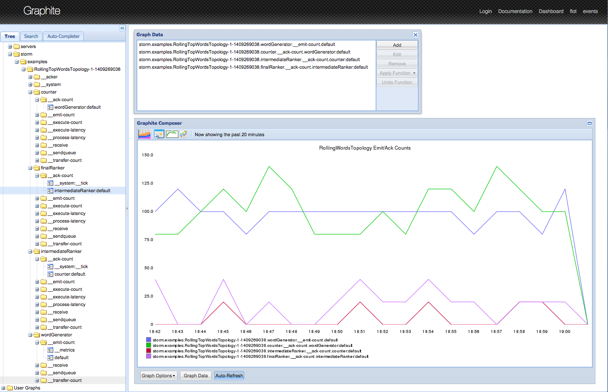

# storm-graphite

Example implementation of a custom [Apache Storm](https://storm.apache.org/) `IMetricsConsumer`
([source](https://github.com/apache/storm/blob/master/storm-core/src/jvm/backtype/storm/metric/api/IMetricsConsumer.java))
that forwards Storm's built-in metrics to a [Graphite](https://github.com/graphite-project/graphite-web) server for
real-time graphing, visualization, and operational dashboards.

---

Table of Contents

* <a href="#Value">Value proposition</a>
* <a href="#Background">Background</a>
* <a href="#Usage">Usage</a>
* <a href="#changelog">Change log</a>
* <a href="#Contributing">Contributing</a>
* <a href="#Authors">Authors</a>
* <a href="#License">License</a>
* <a href="#References">References</a>

---

*Example 1: [Grafana](grafana-visualization-example-01.png) showing used Java heap space across all topologies.*


*Example 2: [Graphite](https://github.com/graphite-project/graphite-web) showing ack count of the "final ranker" bolt*
*in the RollingTopWords topology from [storm-starter](https://github.com/apache/storm/tree/master/examples/storm-starter).*



---

<a name="Value"></a>

# Value proposition

Why should you be interested in storm-graphite or in Storm's metrics in general?

The metrics reported by Storm provide you with many insights into how your Storm clusters and your Storm topologies are
performing.  Sending these metrics to a monitoring tool such as Graphite allows you to visualize this telemetry data,
to create operational dashboards, and to performance-tune and troubleshoot your Storm infrastructure as well your Storm
applications.

For example, the following questions can be answered by Storm's metrics:

* Identify latency bottlenecks: Which spouts or bolts cause the largest processing delay in your data pipeline?
* Troubleshoot Java woes: Which topologies suffer the most from long garbage collection runs?
* Optimize hardware or Storm configuration: Which topologies are running out of memory, and when?

Lastly, you will benefit even more if you are also collecting non-Storm metrics from your infrastructure, e.g.
system/host and networking metrics.  These metrics add further context to the Storm metrics.  A simple example would
be to correlate a high number of context switches on the Storm machines to an increased processing latency of a
topology.


<a name="Background"></a>

# Background

[Apache Storm](https://storm.apache.org/) versions 0.9+ support a built-in [metrics framework](https://storm.apache.org/documentation/Metrics.html)
 for collecting and reporting metrics to external systems.  Storm ships with a
[LoggingMetricsConsumer](https://github.com/apache/storm/blob/master/storm-core/src/jvm/backtype/storm/metric/LoggingMetricsConsumer.java)
that can log these metrics to file.

In comparison, storm-graphite (this project) provides a
[GraphiteMetricsConsumer](src/main/java/com/verisign/storm/metrics/GraphiteMetricsConsumer.java) that reports these
metrics to a [Graphite](https://github.com/graphite-project/graphite-web) server instead of writing to a file.


<a name="Usage"></a>

# Usage

## Overview

You must build and package storm-graphite, and then deploy the package to the machines in your Storm cluster.
The end result of this workflow is a storm-graphite jar file in the `lib/` folder of the Storm installation directory.


## Building and packaging

Your development machine requires a Java JDK. The code works with both Java 6 and Java 7.


### Run the build

    $ ./gradlew clean build

    >>> build/libs/ (artifacts)
          storm-graphite-0.1.2-SNAPSHOT-javadoc.jar
          storm-graphite-0.1.2-SNAPSHOT-sources.jar
          storm-graphite-0.1.2-SNAPSHOT.jar
    >>> build/docs/javadoc/index.html (javadocs)
    >>> build/reports/tests/index.html (test results)

Check the `build/` sub-directory for further information.


### Run the test suite

Run the tests:

    $ ./gradlew test

    >>> build/reports/tests/
    >>> build/reports/tests/index.html
    >>> build/reports/tests/html/index.html

Analyze code coverage:

    $ ./gradlew cobertura

    >>> build/reports/cobertura/coverage.xml
    >>> build/reports/cobertura/index.html


### Package the jar as RPM

Note:  [fpm](https://github.com/jordansissel/fpm) must be installed and available.

    $ ./gradlew clean build rpm

    >>> Generates build/linux-package/storm-graphite-0.1.0_SNAPSHOT-1.verisign.noarch.rpm

You can also provide the optional environment variables `VERSION` (sets the RPM "version"; default: same as the
code's `project.version` in [build.gradle](build.gradle)), `BUILD_NUMBER` (sets the RPM "iteration"; default:
"1.verisign") and `MAINTAINER` (sets the RPM "maintainer"; default: "change.this@email.com").

    $ VERSION=2.0.0 BUILD_NUMBER=3.yourcompany ./gradlew clean jar rpm

    >>> Generates build/linux-package/storm-graphite-2.0.0-3.yourcompany.noarch.rpm

The two environment variables `VERSION` and `BUILD_NUMBER` influence the generated RPM file _but do not modify the_
_packaged jar file_;  e.g. if the `version` parameter in `build.gradle` is set to `0.1.0-SNAPSHOT` and you provide
`VERSION=2.0` when creating the RPM, then the generated RPM will have a version of 2.0 although the embedded
storm-graphite jar file will have the version `0.1.0-SNAPSHOT` (and will be named accordingly).


### IDE support

IntelliJ IDEA:

```
$ ./gradlew cleanIdea idea
```

Eclipse:

```
$ ./gradlew cleanEclipse eclipse
```


## Storm integration


### Installation

The storm-graphite jar file must be made available on Storm's classpath on every node in a Storm cluster.

* The easiest way to achieve this is to place the jar file into `$STORM_HOME/lib/`.
* If you use [puppet-storm](https://github.com/miguno/puppet-storm) and the associated RPM
  [wirbelsturm-rpm-storm](https://github.com/miguno/wirbelsturm-rpm-storm) of
  [Wirbelsturm](https://github.com/miguno/wirbelsturm), then this is the directory `/opt/storm/lib/`.
  Preferably you will deploy the jar file via automated deployment, e.g. through RPM/Puppet.


### Configuration

#### Configuring Storm directly

The GraphiteMetricsConsumer can be registered and configured by adding a snippet similar to the following to
`storm.yaml` (see below) and by configuring the destination Graphite server appropriately (not shown here).

```yaml
---
### Note: This is Storm's storm.yaml configuration file

# Controls the time interval between metric reports
topology.builtin.metrics.bucket.size.secs: 10
topology.metrics.consumer.register:
  - class: "com.verisign.storm.metrics.GraphiteMetricsConsumer"
    parallelism.hint: 1
    argument:
      metrics.graphite.host: "graphite.example.com"
      metrics.graphite.port: "2003"
      metrics.graphite.prefix: "storm.test"
```

You can also experiment with parallelism hints larger than one, or change the bucket time to suit your needs.


#### Configuring Storm via puppet-storm

You can also register the GraphiteMetricsConsumer during an automated, Puppet-based deployment via
[puppet-storm](https://github.com/miguno/puppet-storm#using-hiera) by adding a snippet similar to the following to your
Hiera configuration data.

```yaml
---
### Note: This is a Hiera configuration file (YAML format) for Puppet.

storm::config_map:
  topology.builtin.metrics.bucket.size.secs: 10
  topology.metrics.consumer.register:
    - class: "com.verisign.storm.metrics.GraphiteMetricsConsumer"
      parallelism.hint: 1
      argument:
        metrics.graphite.host: "graphite.example.com"
        metrics.graphite.port: "2003"
        metrics.graphite.prefix: "storm.test"
```

You can also experiment with parallelism hints larger than one, or change the bucket time to suit your needs.


#### Configuring Graphite/Grafana

Assuming that you have a working Graphite or Grafana instance up and running, you can create queries such as the
following to visualize your Storm metrics.  The example below is a Graphite query to construct the "Storm topologies:
used Java heap space" visualization in the screenshots above:

```
groupByNode(aliasSub(storm.cluster.metrics.*.__system.memory.heap.usedBytes, '^storm\.cluster\.metrics\.(.*)-(\d+)-(\d+)\.(.*)$', 'storm.cluster.metrics.\1.\4'), 3, 'sumSeries')
```

This query provides the data for the following Grafana visualization:


Further examples:

```
# Java garbage collection time by topology
groupByNode(aliasSub(storm.cluster.metrics.*.__system.GC.*.timeMs, "^storm\.cluster\.metrics\.(.*)-(\d+)-(\d+)\.__system.GC\.(.*)\.timeMs$", "storm.cluster.metrics.\1.__system.GC.\4.timeMs"), 3, "sumSeries")

# Execution count (of Storm tuples) by bolt
groupByNode(aliasSub(storm.cluster.metrics.*.*.__execute-count.*, "^storm\.cluster\.metrics\.(.*)-(\d+)-(\d+)\.(.*)\.__execute-count\.", "storm.cluster.metrics.\1.\4.__execute-count"), 4, "sumSeries")

# Execution latency by bolt
groupByNode(aliasSub(storm.cluster.metrics.*.*.__execute-latency.*, "^storm\.cluster\.metrics\.(.*)-(\d+)-(\d+)\.(.*)\.__execute-latency\.", "storm.cluster.metrics.\1.\4.__execute-latency"), 4, "sumSeries")

```


<a name="changelog"></a>

# Change log

See [CHANGELOG](CHANGELOG.md).


<a name="Contributing"></a>

# Contributing to storm-graphite

Code contributions, bug reports, feature requests etc. are all welcome.

If you are new to GitHub please read [Contributing to a project](https://help.github.com/articles/fork-a-repo) for how
to send patches and pull requests to storm-graphite.


<a name="Authors"></a>

# Authors

* [Kevin Mao](https://github.com/KevinJMao)
* [Michael Noll](https://github.com/miguno)


<a name="License"></a>

# License

Copyright © 2014-2015 [VeriSign, Inc.](http://www.verisigninc.com/)

See [LICENSE](LICENSE) for licensing information.


<a name="References"></a>

# References

* Official Storm project:
    * [Metrics documentation](https://storm.apache.org/documentation/Metrics.html)
    * [LoggingMetricsConsumer.java](https://github.com/apache/storm/blob/master/storm-core/src/jvm/backtype/storm/metric/LoggingMetricsConsumer.java),
      which logs Storm's built-in metrics to file
* [Storm Metrics How-to](http://www.bigdata-cookbook.com/post/72320512609/storm-metrics-how-to), blog post, Jan 2014
* [Sending Metrics from Storm to Graphite](http://www.michael-noll.com/blog/2013/11/06/sending-metrics-from-storm-to-graphite/), blog post, Nov 2013
