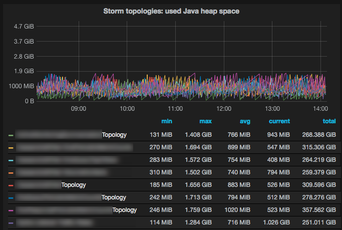

# storm-graphite [](https://travis-ci.org/verisign/storm-graphite) [](https://coveralls.io/r/verisign/storm-graphite?branch=master)

An [Apache Storm](https://storm.apache.org/) `IMetricsConsumer`
([source](https://github.com/apache/storm/blob/master/storm-core/src/jvm/backtype/storm/metric/api/IMetricsConsumer.java))
implementation that forwards Storm's built-in metrics to a [Graphite](https://github.com/graphite-project/graphite-web) server for
real-time graphing, visualization, and operational dashboards. We also provide the option to forward these metrics to 
Apache [Kafka](https://github.com/apache/kafka) instead of Graphite, which may be preferable when your Storm clusters are large.

---

Table of Contents

* <a href="#Value">Value proposition</a>
* <a href="#Background">Background</a>
* <a href="#Usage">Usage</a>
    * <a href="#usage-overview">Overview</a>
    * <a href="#supported-storm-versions">Supported Storm versions</a>
    * <a href="#building-packaging">Building and packaging</a>
    * <a href="#storm-integration">Storm integration</a>
    * <a href="#graphite-configuration">Configuring Graphite/Grafana</a>
* <a href="#changelog">Change log</a>
* <a href="#Contributing">Contributing</a>
* <a href="#Authors">Authors</a>
* <a href="#License">License</a>
* <a href="#References">References</a>

---

*Example: [Grafana](grafana-visualization-example-01.png) showing execution latency of bolts.*



---

<a name="Value"></a>

# Value proposition

Why should you be interested in storm-graphite or in Storm's metrics in general?

The metrics reported by Storm provide you with many insights into how your Storm clusters and your Storm topologies are
performing.  Sending these metrics to a monitoring tool such as Graphite allows you to visualize this telemetry data,
to create operational dashboards, and to performance-tune and troubleshoot your Storm infrastructure as well your Storm
applications.

For example, the following questions can be answered by Storm's metrics:

* Identify latency bottlenecks: Which spouts or bolts cause the largest processing delay in your data pipeline?
* Troubleshoot Java woes: Which topologies suffer the most from long garbage collection runs?
* Optimize hardware or Storm configuration: Which topologies are running out of memory, and when?

Lastly, you will benefit even more if you are also collecting non-Storm metrics from your infrastructure, e.g.
system/host and networking metrics.  These metrics add further context to the Storm metrics.  A simple example would
be to correlate a high number of context switches on the Storm machines to an increased processing latency of a
topology.


<a name="Background"></a>

# Background

[Apache Storm](https://storm.apache.org/) versions 0.9+ support a built-in [metrics framework](https://storm.apache.org/documentation/Metrics.html)
 for collecting and reporting metrics to external systems.  Storm ships with a
[LoggingMetricsConsumer](https://github.com/apache/storm/blob/master/storm-core/src/jvm/backtype/storm/metric/LoggingMetricsConsumer.java)
that can log these metrics to file.

In comparison, storm-graphite (this project) provides a
[GraphiteMetricsConsumer](src/main/java/com/verisign/storm/metrics/GraphiteMetricsConsumer.java) that reports these
metrics to a [Graphite](https://github.com/graphite-project/graphite-web) server instead of writing to a file.

For large Storm clusters emitting a high volume of metrics, we've included a [KafkaReporter](src/main/java/com/verisign/storm/metrics/reporters/KafkaReporter.java) that reports metrics to a configurable [Kafka](https://kafka.apache.org/) topic. Applications leveraging a Kafka consumer can then subscribe to this topic and consume the Avro-encoded metric messages using the supplied Avro [schema](src/main/avro/graphingMetrics.avsc). This can be useful for sending metric data to multiple endpoints, introducing flow control, and ensuring durability.

The KafkaReporter also features integration with Confluent's RESTful Avro schema storage and retrieval service, [Schema Registry](https://github.com/confluentinc/schema-registry).

<a name="Usage"></a>

# Usage


<a name="usage-overview"></a>

## Overview

You must build and package storm-graphite, and then deploy the package to the machines in your Storm cluster.
The end result of this workflow is a storm-graphite jar file in the `lib/` folder of the Storm installation directory.


<a name="supported-storm-versions"></a>

## Supported Storm versions

* Storm 0.9.x
* Storm 0.10.0 (not yet released by Apache Storm project)


<a name="building-packaging"></a>

## Building and packaging

Your development machine requires a Java JDK. The code works with both Java 6 and Java 7, though by default the build
is against Java 7.


### Run the build

The build will create several jars.  You must make one and only one of these jar files available to Storm:
the `storm-graphite-${VERSION}-all.jar` (note the `-all`).

    $ ./gradlew clean build

    >>> build/libs/ (artifacts)
          storm-graphite-0.1.4-SNAPSHOT-all.jar
          storm-graphite-0.1.4-SNAPSHOT-javadoc.jar
          storm-graphite-0.1.4-SNAPSHOT-sources.jar
          storm-graphite-0.1.4-SNAPSHOT.jar
    >>> build/docs/javadoc/index.html (javadocs)
    >>> build/reports/tests/index.html (test results)

Check the `build/` sub-directory for further information.


### Run the test suite

Run the tests:

    $ ./gradlew test

    >>> build/reports/tests/
    >>> build/reports/tests/index.html
    >>> build/reports/tests/html/index.html

Analyze code coverage:

    $ ./gradlew cobertura

    >>> build/reports/cobertura/coverage.xml
    >>> build/reports/cobertura/index.html


### Package the jar as RPM

The RPM provides a jar that contains storm-graphite as well as a relocated
[Dropwizard Metrics](https://dropwizard.github.io/metrics/) library.  We include the Metrics library to ensure that
storm-graphite runs against a specific, known version of Metrics, and the relocation will prevent conflicts in case
your applications use a different version of Metrics.

Create the RPM:

    $ ./gradlew clean build rpm

The output will depend on whether the version is a release or a snapshot:

    # Releases (here: "0.1.4")
    #
    RPM: build/distributions/storm-graphite-0.1.4-1.noarch.rpm

    $ rpm -qpi storm-graphite-0.1.4-1.noarch.rpm
    Name        : storm-graphite               Relocations: (not relocatable)
    Version     : 0.1.4                             Vendor: Verisign
    Release     : 1


    # Snapshots (here: "0.1.4-SNAPSHOT", built on Mar 04 2015 based on git commit 8ed273e)
    #
    RPM: build/distributions/storm-graphite-0.1.4-0.1.20150304git8ed273e.noarch.rpm

    $ rpm -qpi
    Name        : storm-graphite               Relocations: (not relocatable)
    Version     : 0.1.4                             Vendor: Verisign
    Release     : 0.1.20150304git8ed273e


The default RPM settings will place the storm-graphite jar under `/opt/storm/lib/`:

    # Example location (here: snapshot version)
    /opt/storm/lib/storm-graphite-0.1.4-SNAPSHOT-all.jar

You can also provide the following optional environment variables:

* `VERSION`: sets the RPM `Version` field; default: same as the code's `project.version` in
  [build.gradle](build.gradle), with any `-SNAPSHOT` suffix removed)
* `RPM_RELEASE`: sets the RPM `Release` field; default: `1` for releases, `0.<INCR>.<YYYYMMDD>git<COMMIT>` for snapshots
  (where `<INCR>` will be set to the value of the environment variable `BUILD_NUMBER`, if available)
* `MAINTAINER`: sets the RPM `Packager` field; default: "change.this@email.com")

Example:

    $ VERSION=2.0.0 RPM_RELEASE=3.yourcompany ./gradlew clean build rpm

    >>> Generates build/distributions/storm-graphite-2.0.0-3.yourcompany.noarch.rpm

The environment variables `VERSION` and `RPM_RELEASE` influence the generated RPM file _but do not modify the_
_packaged jar file_;  e.g. if the `version` parameter in `build.gradle` is set to `0.1.0-SNAPSHOT` and you provide
`VERSION=2.0` when creating the RPM, then the generated RPM will have a version of 2.0 although the embedded
storm-graphite jar file will have the version `0.1.0-SNAPSHOT` (and will be named accordingly).


### Package the jar as DEB

Example:

    $VERSION=2.0.0 RPM_RELEASE=3.yourcompany ./gradlew clean build deb

    >>> Generates build/distributions/storm-graphite_2.0.0-3.yourcompany_all.deb


### IDE support

IntelliJ IDEA:

    $ ./gradlew cleanIdea idea

Eclipse:

    $ ./gradlew cleanEclipse eclipse


<a name="storm-integration"></a>

## Storm integration

### Installation

The jar file `storm-graphite-${VERSION}-all.jar` -- and only this jar file -- must be made available on Storm's
classpath on every node in a Storm cluster.

> **IMPORTANT**: Do not use `storm-graphite-${VERSION}.jar` instead of the `-all` jar file because the former does
> not include transitive dependencies of storm-graphite.  If you do use the wrong jar file, you will run into
> [NoClassDefFoundError](https://github.com/verisign/storm-graphite/issues/6#issuecomment-82580787) at run-time.

* Option 1: Package and then install the RPM (or DEB) of storm-graphite on each Storm node.  Make sure that the
  `$STORM_HOME/lib/` of your Storm installation matches the installation prefix of the storm-graphite RPM/DEB
  (which is `/opt/storm/lib/`).  If you need to customize the location, modify [build.gradle](build.gradle)
  accordingly (search the file for `/opt/storm`).
    * Note: The `/opt/storm/lib/` location matches the directory layout created by
      [puppet-storm](https://github.com/miguno/puppet-storm) and the associated RPM
      [wirbelsturm-rpm-storm](https://github.com/miguno/wirbelsturm-rpm-storm) of
      [Wirbelsturm](https://github.com/miguno/wirbelsturm).  So if you use any of these tools already, you're
      good to go.
* Option 2: Place the `*-all.jar` file into `$STORM_HOME/lib/` without packaging the jar file into an RPM or DEB.

Option 1 is typically preferred by those users who already have automated deployment setups (think: Puppet, Ansible).


### Configuration

#### Configuring Storm directly

The GraphiteMetricsConsumer can be registered and configured by adding a snippet similar to the following to
`storm.yaml` (see below) and by configuring the destination Graphite server appropriately (not shown here). Note that
an individual consumer cannot be configured to report to both Graphite and Kafka. However, two separate consumers may
be registered for each reporter.

##### Reporting Metrics to Graphite
```yaml
---
### Note: This is Storm's storm.yaml configuration file

# Controls the time interval between metric reports
topology.builtin.metrics.bucket.size.secs: 10
topology.metrics.consumer.register:
  - class: "com.verisign.storm.metrics.GraphiteMetricsConsumer"
    parallelism.hint: 1
    argument:
      metrics.reporter.name: "com.verisign.storm.metrics.reporters.graphite.GraphiteReporter"
      metrics.graphite.host: "graphite.example.com"
      metrics.graphite.port: "2003"
      metrics.graphite.prefix: "storm.test"
      metrics.graphite.min-connect-attempt-interval-secs: "5"
      # Optional arguments can also be supplied to enable UDP
      metrics.graphite.protocol: "udp"
```
##### Reporting Metrics to Kafka

```yaml
---
### Note: This is Storm's storm.yaml configuration file
### Note: Kafka producer settings can be passed as registration arguments.

# Controls the time interval between metric reports
topology.builtin.metrics.bucket.size.secs: 10
topology.metrics.consumer.register:
  - class: "com.verisign.storm.metrics.GraphiteMetricsConsumer"
    parallelism.hint: 1
    argument:
      metrics.reporter.name: "com.verisign.storm.metrics.reporters.kafka.KafkaReporter"
      metrics.graphite.prefix: "storm.test"
	  metrics.kafka.topic: "metricsTopic"
	  metrics.kafka.metadata.broker.list: "broker1.example.com:9092,broker2.example.com:9092,broker3.example.com:9092"
	  # Optional arguments can also be supplied to integrate with Confluent's Schema Registry
	  metrics.kafka.schema.registry.url: "http://schemaregistry.example.com:8081"
	  metrics.kafka.schema.registry.id.capacity: 100
```


You can also experiment with parallelism hints larger than one, or change the bucket time to suit your needs.


#### Configuring Storm via puppet-storm

You can also register the GraphiteMetricsConsumer during an automated, Puppet-based deployment via
[puppet-storm](https://github.com/miguno/puppet-storm#using-hiera) by adding a snippet similar to the following to your
Hiera configuration data.

```yaml
---
### Note: This is a Hiera configuration file (YAML format) for Puppet.

storm::config_map:
  topology.builtin.metrics.bucket.size.secs: 10
  topology.metrics.consumer.register:
    - class: "com.verisign.storm.metrics.GraphiteMetricsConsumer"
      parallelism.hint: 1
      argument:
        metrics.reporter.name: "com.verisign.storm.metrics.reporters.GraphiteReporter"
        metrics.graphite.host: "graphite.example.com"
        metrics.graphite.port: "2003"
        metrics.graphite.prefix: "storm.test"
        metrics.graphite.min-connect-attempt-interval-secs: "5"
```

You can also experiment with parallelism hints larger than one, or change the bucket time to suit your needs.


#### Restart Storm daemons

Once storm-graphite is installed and configured, you must restart the Storm daemons on each cluster node for these
changes to take effect.  To minimize cluster downtime you can perform a rolling restart.


### Execution model

The Graphite metrics consumer will run for every topology with which it is registered:

* If you have added the metrics consumer to Storm's global configuration file `storm.yaml, then every topology will run
  its own metrics consumer.
* If you have registered the metrics consumer on a topology level, i.e. via a topology's configuration, then it will
  run only for this topology / these topologies.

At runtime the metrics consumer is executed as a system bolt, which is hidden in the Storm UI by default (click on
the button "Show System Stats" at the bottom of the Storm UI to display the bolt).  Every other, non-system topology
component (i.e. spouts and bolts) is then wired to the metrics system bolt and will be sending metrics to the bolt
on a `topology.builtin.metrics.bucket.size.secs` interval.

For example, if you have a topology with:

* 1 spout with parallelism 5
* 1 bolt A with parallelism 8
* 1 bolt B with parallelism 3

then `5 + 8 + 3 = 16` spout/bolt instances are sending a full set of metrics every
`N = topology.builtin.metrics.bucket.size.secs` seconds to the metrics consumer bolt.

What does this mean for Graphite?  First, every set of metrics being sent to the bolt will cause a new TCP
connection being established to Graphite, which will be closed again once the set of metrics has been fully sent to
Graphite.  In our example above, 16 connections will be created/closed during a window of `N` seconds.


<a name="graphite-configuration"></a>

## Configuring Graphite/Grafana


### Metrics path

The metrics path is generated according to the following scheme:

    ${metrics.graphite.prefix}.TOPOLOGY_ID_WITHOUT_NONCE.COMPONENT_ID.WORKER_HOST.WORKER_PORT.TASK_ID.DATAPOINT_NAME.KEY

where `WORKER_HOST` is the fully qualified hostname of a machine.

An example path may look like:

    myCustomGraphitePrefix.myTopologyName.myBoltId.storm-slave-01.foo.example.com.6700.3008.foo.bar


### Carbon configuration

You must configure carbon's storage settings (`storage-schemas.conf`) so that these settings match the configuration of
the Graphite metrics consumer.

* The _pattern_ setting must match the `metrics.graphite.prefix` of your storm-graphite setup.
* The _retention_ setting -- notably the first, most granular field -- must match the
  `topology.builtin.metrics.bucket.size.secs` of your storm-graphite setup.

For example, if you have the following Graphite metrics consumer settings in `storm.yaml`:

```yaml
---
### Note: This is Storm's storm.yaml configuration file

topology.builtin.metrics.bucket.size.secs: 10
topology.metrics.consumer.register:
  - class: "com.verisign.storm.metrics.GraphiteMetricsConsumer"
    argument:
      metrics.reporter.name: "com.verisign.storm.metrics.reporters.GraphiteReporter"
      metrics.graphite.prefix: "storm.cluster.metrics"
    ...
```

Then carbon's storage settings should have an entry similar to:

    [storm_metrics]
    pattern = ^storm\.cluster\.metrics\.
    retentions = 10s:2d,1m:30d,5m:90d,1h:2y


### Graphite queries

Assuming that you have a working Graphite or Grafana instance up and running, you can create queries such as the
following to visualize your Storm metrics.  The example below is a Graphite query to construct the "Storm topologies:
used Java heap space" visualization in the screenshots above, with `metrics.graphite.prefix` set to
`storm.cluster.metrics`:

```
groupByNode(storm.cluster.metrics.*.*.*.*.*.*.*.*.__execute-latency.*, 4, 'sumSeries')
```

> Note: The exact metric path depends on your hostname scheme because the path contains the fully qualified hostname
> of each machine.  For example, the query above works out of the box for hostnames that match
> `server1.foo.example.com` (= four components).  If, say, your scheme is `server1.example.com` (= three components),
> then the depth of the metrics path will be reduced by 1;  e.g.
> "storm.cluster.metrics.\*.__system.\*.\*.\*.\*.\*.\*.memory.heap.usedBytes" becomes
> "storm.cluster.metrics.\*.__system.\*.\*.\*.\*.\*.memory.heap.usedBytes".

This query provides the data for the following Grafana visualization:


Further examples:

```
# Used Java heap space by worker process
groupByNode(aliasSub(storm.cluster.metrics.*.__system.*.*.*.*.*.*.memory.heap.usedBytes, '^storm\.cluster\.metrics\.(.+)\.__system\.(.+)\.(.+)\.(.+)\.(.+)\.(.+)\.(.*)\.memory.heap.usedBytes$', 'storm.cluster.metrics.\1-\2-\6.memory.heap.usedBytes'), 3, 'sumSeries')

# Java garbage collection time by topology
groupByNode(storm.cluster.metrics.*.__system.*.*.*.*.*.*.GC.*.timeMs, 3, 'sumSeries')

# Execution count (of Storm tuples) by bolt
groupByNode(storm.cluster.metrics.*.*.*.*.*.*.*.*.__execute-count.*, 4, 'sumSeries')

# Execution latency by bolt
groupByNode(storm.cluster.metrics.*.*.*.*.*.*.*.*.__execute-latency.*, 4, 'sumSeries')
```


<a name="changelog"></a>

# Change log

See [CHANGELOG](CHANGELOG.md).


<a name="Contributing"></a>

# Contributing to storm-graphite

Code contributions, bug reports, feature requests etc. are all welcome.

If you are new to GitHub please read [Contributing to a project](https://help.github.com/articles/fork-a-repo) for how
to send patches and pull requests to storm-graphite.


<a name="Authors"></a>

# Authors

* [Kevin Mao](https://github.com/KevinJMao)
* [Michael Noll](https://github.com/miguno)


<a name="License"></a>

# License

Copyright © 2014-2015 [VeriSign, Inc.](http://www.verisigninc.com/)

See [LICENSE](LICENSE) for licensing information.


<a name="References"></a>

# References

* Official Storm project:
    * [Metrics documentation](https://storm.apache.org/documentation/Metrics.html)
    * [LoggingMetricsConsumer.java](https://github.com/apache/storm/blob/master/storm-core/src/jvm/backtype/storm/metric/LoggingMetricsConsumer.java),
      which logs Storm's built-in metrics to file
* [Storm Metrics How-to](http://www.bigdata-cookbook.com/post/72320512609/storm-metrics-how-to), blog post, Jan 2014
* [Sending Metrics from Storm to Graphite](http://www.michael-noll.com/blog/2013/11/06/sending-metrics-from-storm-to-graphite/), blog post, Nov 2013
